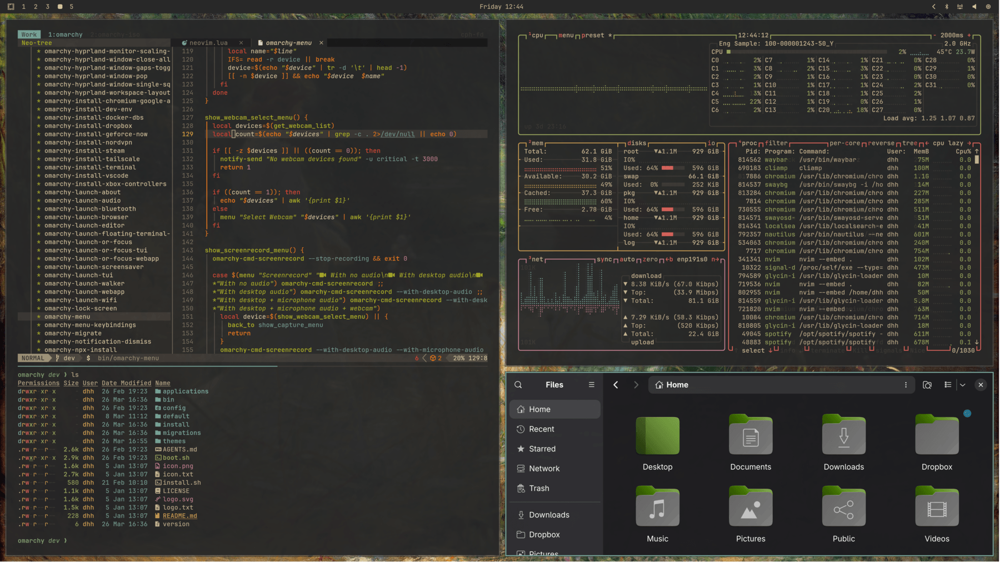
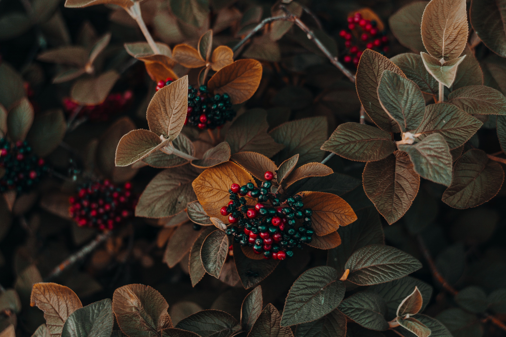
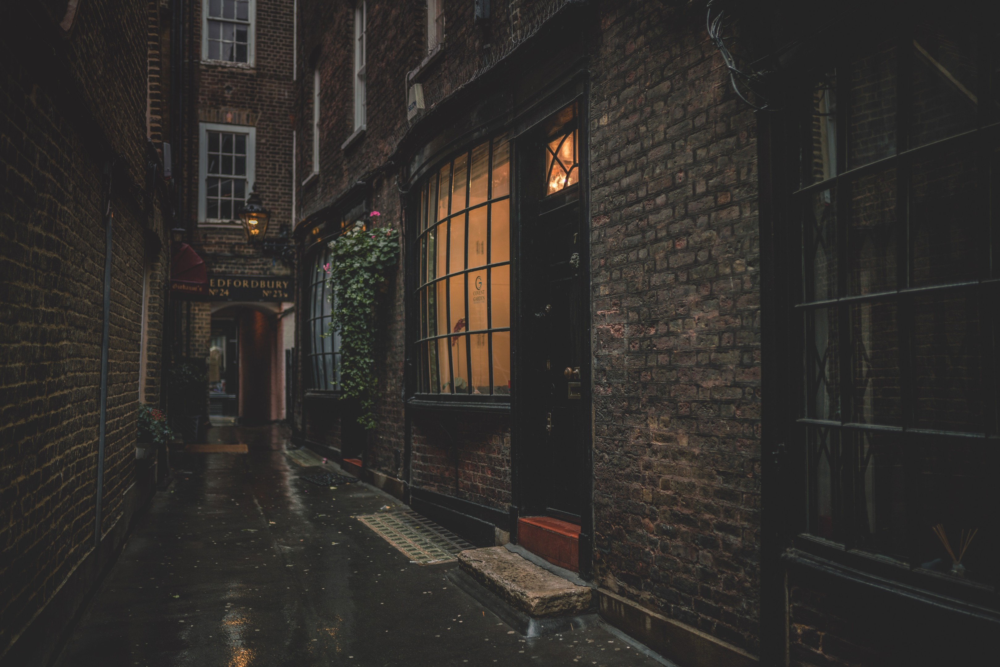
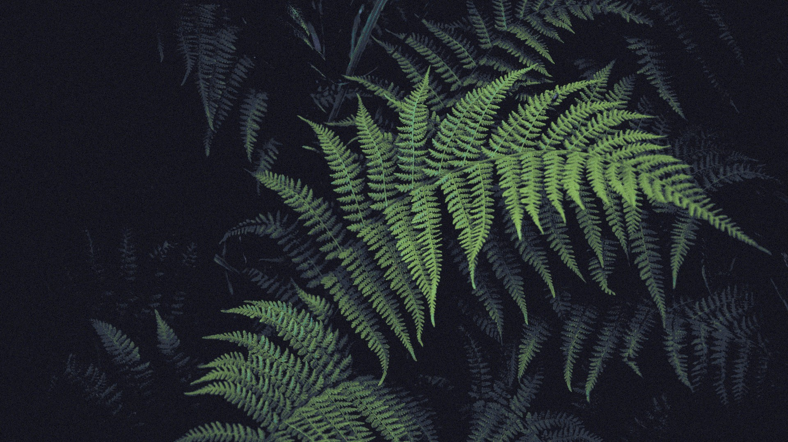
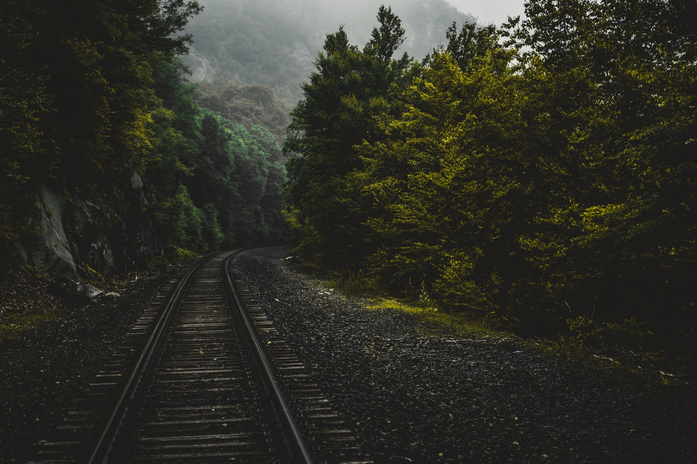
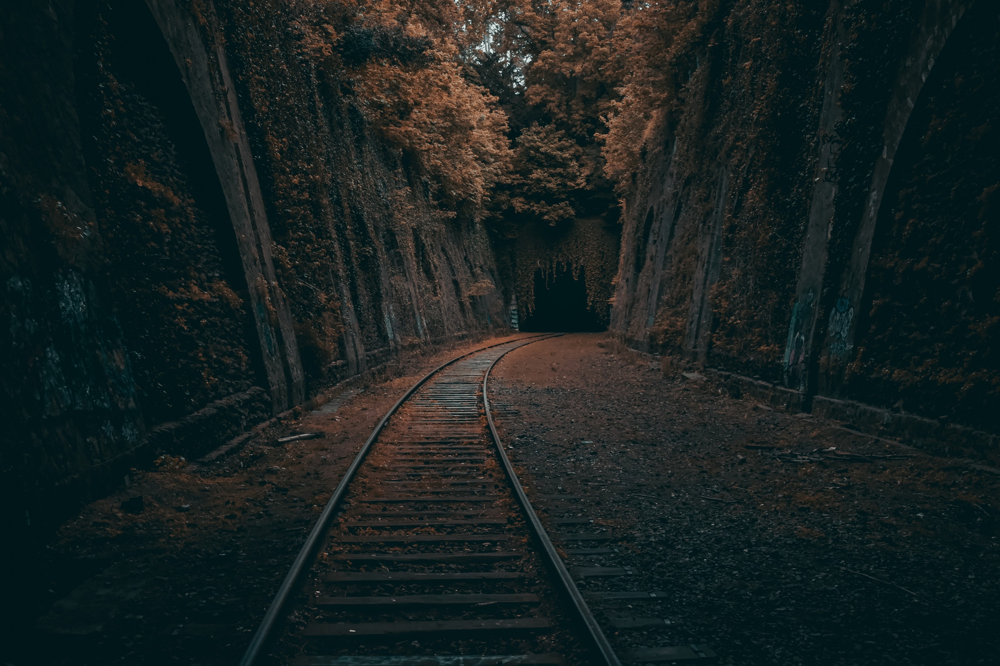
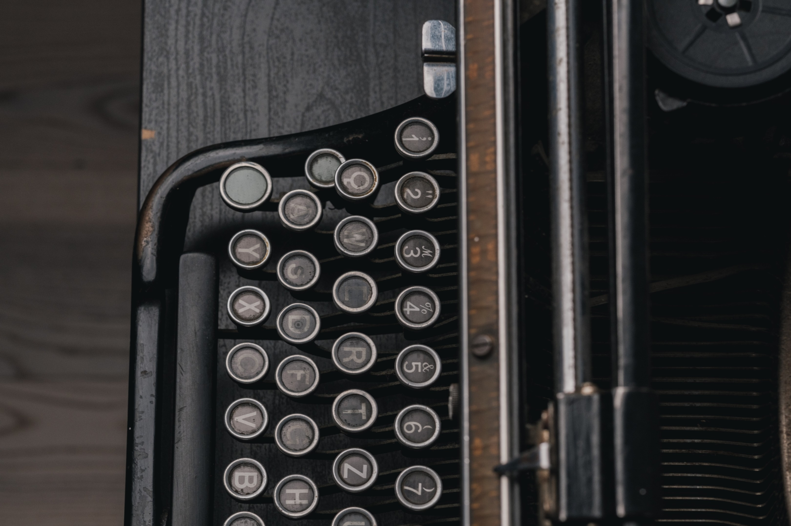

# Omarchy Gruvbox Material Medium Override

A canonical enhancement for Omarchy's built-in Gruvbox theme. It keeps the official theme as its foundation, then corrects the palette and generated integrations to **Gruvbox Material Dark, Medium**: warm charcoal surfaces, parchment text, muted aqua focus, and the original Material accent set.

## Preview



## Install

Install it like a normal Omarchy theme:

```bash
omarchy theme install https://github.com/OldJobobo/omarchy-gruvbox-theme
```

The repository name resolves to `gruvbox`, so Omarchy loads it as a user override of the built-in Gruvbox theme. Files supplied here replace or extend their matching base-theme files; everything else continues to come from Omarchy's official theme.

## Branches

- **`master`** — the restrained canonical override: Gruvbox Material Dark, Medium without turning the base theme into a different design.
- **`material`** — the fuller Material treatment, with broader application styling and more opinionated desktop surfaces.

After installing the default branch, switch the user override to the extended branch with:

```bash
git -C ~/.config/omarchy/themes/gruvbox fetch origin material
git -C ~/.config/omarchy/themes/gruvbox switch material
omarchy theme set gruvbox
```

## Omarchy Quattro support

The override includes the native Omarchy 4/Quattro theme path:

- `colors.toml` provides the Gruvbox Material palette, compatibility ANSI colors, and semantic Quattro roles.
- `shell.toml` carries the palette through the bar, controls, popups, notifications, launcher, menus, authentication prompts, lock prompt, and image picker.
- `hyprland.lua` coordinates borders, groups, rounding, shadow, and blur with the same Material colors.
- Generated integrations cover supported terminals, Helix, Pi, VS Code-family editors, Gum, RGB keyboards, Chromium, and the screen-share picker.

The supplied integration files are intentional where preserving exact Gruvbox Material color assignments matters. Omarchy can continue generating routine files from `colors.toml` as its templates evolve.

## Wallpapers

A cohesive six-image set built around shadowed greenery, weathered materials, warm window light, and quiet analog detail.

<table>
  <tr>
    <td></td>
    <td></td>
    <td></td>
  </tr>
  <tr>
    <td></td>
    <td></td>
    <td></td>
  </tr>
</table>

## Notes

- This is deliberately an enhancement layer, not a standalone replacement for Omarchy's built-in Gruvbox theme.
- The palette targets the dark, medium-background Gruvbox Material family.
- Omarchy 4/Quattro uses the native `shell.toml` and `hyprland.lua` files. Compatibility and optional app overrides remain available where shipped.

## Attribution

- [Gruvbox Material](https://github.com/sainnhe/gruvbox-material) by sainnhe.
